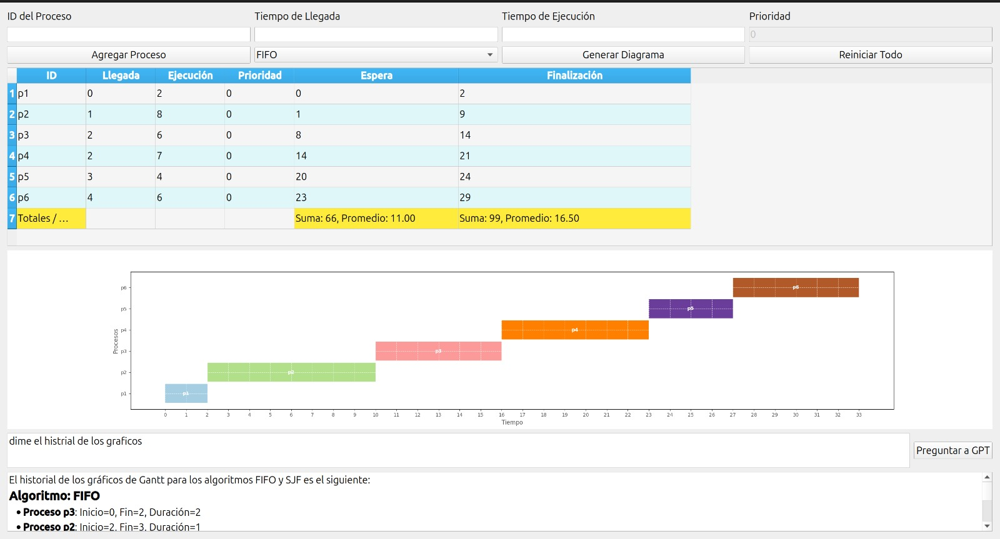

# Algoritmos de Despacho de Procesos

Este proyecto implementa diversos **algoritmos de despacho de procesos** (FIFO, SJF y Prioridad) a través de una **interfaz gráfica de usuario (GUI)** utilizando **PyQt5**. Además, se integra con **OpenAI** para proporcionar análisis detallados de los resultados obtenidos.

<p align="center">
  
</p>

## Tabla de Contenidos

1. [Requisitos](#requisitos)
2. [Instalación](#instalación)
3. [Uso](#uso)
4. [Estructura del Proyecto](#estructura-del-proyecto)
5. [Pruebas](#pruebas)
6. [Prompts de Demostración](#prompts-de-demostración)
7. [Licencia](#licencia)

## Requisitos

- **Python 3.7** o superior.

## Instalación

Sigue estos pasos para configurar y ejecutar el proyecto en tu máquina local:

### 1. Clonar el Repositorio

```bash
git clone https://github.com/josefdc/Algoritmos-Despacho.git
cd Algoritmos-Despacho
```

### 2. Crear un Entorno Virtual

Crea un entorno virtual para mantener las dependencias del proyecto aisladas del sistema global.

**En Linux/macOS:**

```bash
python3 -m venv .venv
source .venv/bin/activate
```

**En Windows:**

```bash
python -m venv .venv
.venv\Scripts\activate
```

### 3. Instalar Dependencias

Instala las dependencias requeridas listadas en el archivo `requirements.txt`.

```bash
pip install -r requirements.txt
```

### 4. Configurar las Variables de Entorno

Crea un archivo `.env` en la raíz del proyecto para almacenar tu clave de API de OpenAI:

```bash
OPENAI_API_KEY=tu_clave_de_api_aqui
```

Asegúrate de reemplazar `tu_clave_de_api_aqui` con tu clave de API real de OpenAI.

### 5. Ejecutar la Aplicación

Ejecuta el archivo `main.py` para iniciar la aplicación:

```bash
python src/main.py
```

### 6. Ejecutar Pruebas

Para ejecutar las pruebas unitarias y verificar que todo funcione correctamente, usa:

```bash
python -m unittest discover tests
```

## Uso

La aplicación GUI permite a los usuarios:

1. **Agregar procesos** con su ID, tiempo de llegada, tiempo de ejecución y prioridad.
2. **Seleccionar el algoritmo de despacho** deseado (FIFO, SJF, Prioridad).
3. **Generar el diagrama de Gantt** para visualizar cómo se programan los procesos.
4. **Obtener análisis de los resultados** utilizando la API de OpenAI.

## Estructura del Proyecto

- `main.py`: Punto de entrada principal de la aplicación.
- `gui.py`: Implementación de la interfaz gráfica de usuario (GUI) utilizando PyQt5.
- `scheduler.py`: Contiene la lógica de los algoritmos de planificación (FIFO, SJF, Prioridad).
- `gantt_chart.py`: Módulo para generar gráficos de Gantt utilizando Matplotlib.
- `openai_client.py`: Cliente para interactuar con la API de OpenAI.
- `test_main.py`: Pruebas unitarias para verificar la funcionalidad de los algoritmos de planificación.
- `requirements.txt`: Lista de todas las dependencias necesarias para ejecutar el proyecto.

## Pruebas

Las pruebas unitarias están implementadas en `test_main.py` y verifican la funcionalidad de los algoritmos de despacho de procesos (FIFO, SJF, Prioridad). Para ejecutar las pruebas, usa:

```bash
python -m unittest discover tests
```

## Prompts de Demostración

El proyecto incluye la capacidad de interactuar con OpenAI GPT para analizar y comparar resultados de los algoritmos de planificación. Algunos ejemplos de prompts que puedes usar:

1. **Comparación entre Algoritmos de Planificación:**
   - Prompt: `¿Cuál es la diferencia en el tiempo de espera total y promedio cuando se utiliza el algoritmo FIFO en comparación con SJF y Prioridad para los procesos actuales? ¿Cuál es más eficiente en términos de tiempo de espera?`

2. **Análisis de Resultados en Detalle:**
   - Prompt: `Explica cómo se ejecutan los procesos en el diagrama de Gantt cuando se utiliza el algoritmo de planificación Prioridad. ¿Qué impacto tiene esto en el tiempo de finalización y de espera?`

3. **Predicción de Comportamiento con Cambios en los Procesos:**
   - Prompt: `Si el tiempo de llegada del proceso P3 se retrasa en 4 unidades de tiempo, ¿cómo cambiaría el diagrama de Gantt y el tiempo de espera total utilizando el algoritmo SJF?`

4. **Estrategias de Mejoramiento:**
   - Prompt: `¿Qué estrategias podríamos considerar para mejorar el tiempo de espera promedio de los procesos utilizando algoritmos de planificación más avanzados o ajustando los parámetros actuales?`

## Licencia

Este proyecto está bajo la Licencia MIT - vea el archivo [LICENSE](LICENSE) para más detalles.
